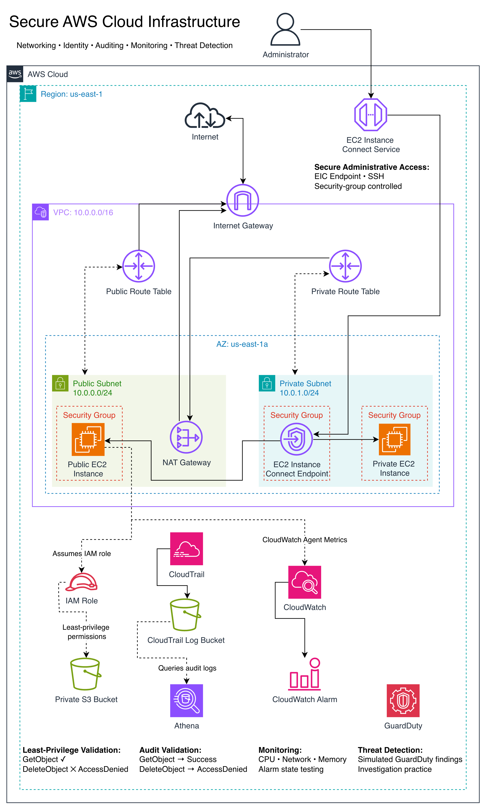
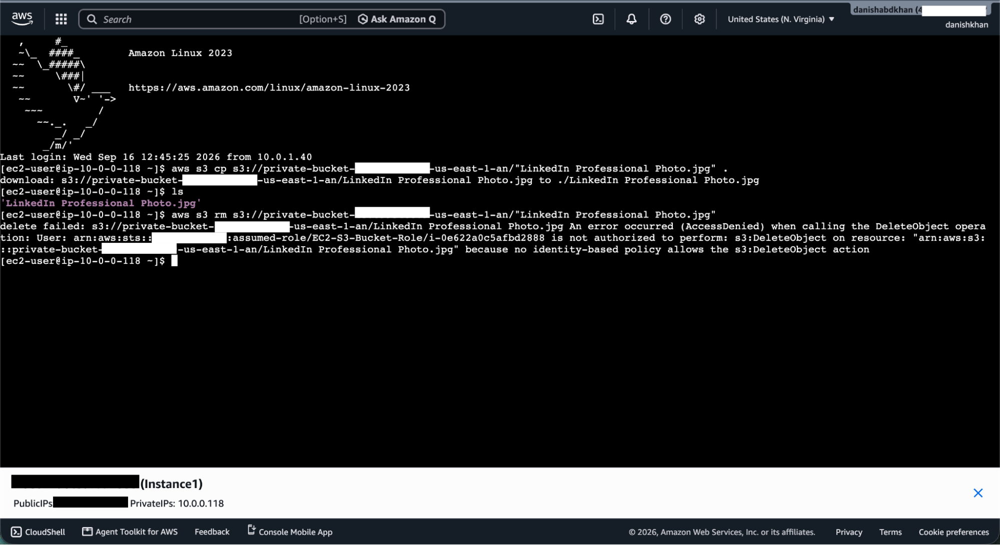
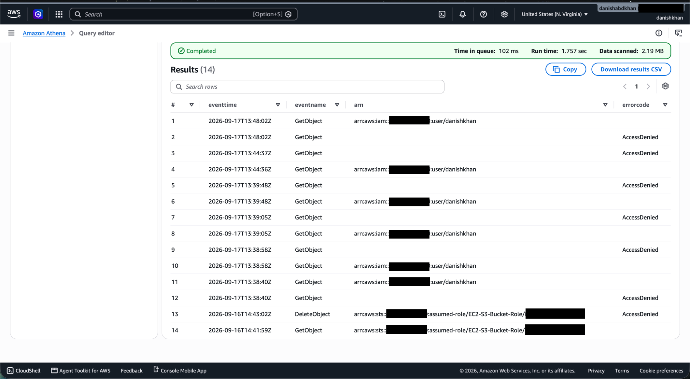
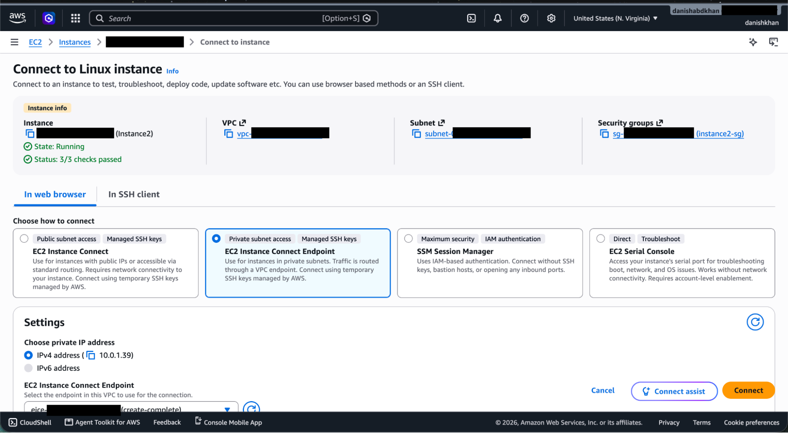
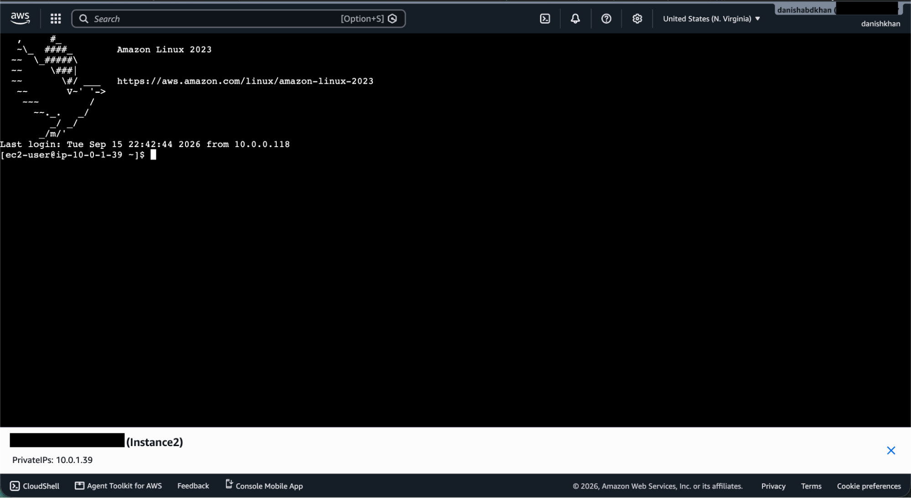
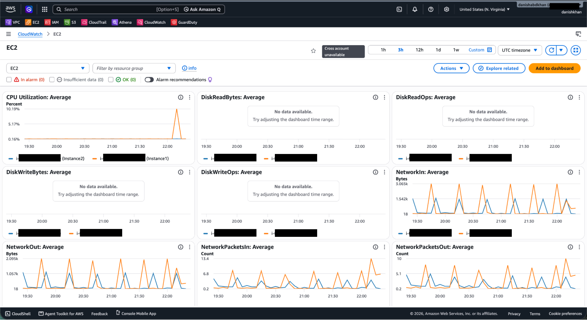
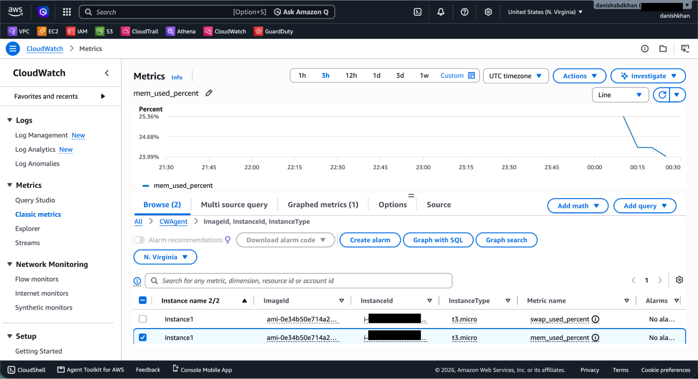
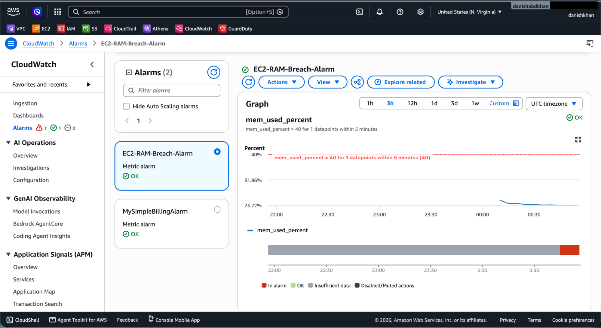
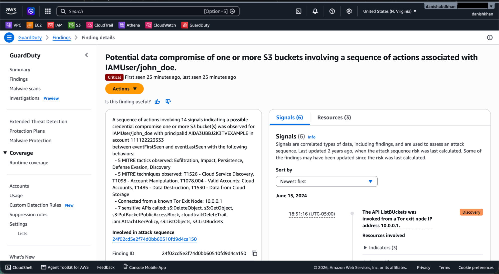

# Secure AWS Cloud Infrastructure Lab

A hands-on AWS cloud security lab focused on secure network architecture, least-privilege identity and access management, auditing, monitoring, and threat detection.

This project was built to gain practical experience designing and securing AWS infrastructure beyond certification-level knowledge. I deployed the environment manually, tested security controls, investigated failures, and validated the final configuration through hands-on testing.

## Project Overview

The environment uses a custom VPC with segmented public and private subnets, controlled administrative access, IAM-based workload permissions, centralized audit logging, system monitoring, and threat detection.

The project demonstrates:

- VPC networking with public and private subnet segmentation
- Internet Gateway and NAT Gateway routing
- Security group-based traffic control
- EC2 Instance Connect Endpoint for administrative SSH access
- IAM roles and custom least-privilege permissions
- Private Amazon S3 object access from EC2 without static credentials
- AWS CloudTrail logging and audit analysis with Amazon Athena
- Amazon CloudWatch Agent metrics and alarm testing
- Amazon GuardDuty threat detection and finding investigation
- Linux and AWS networking troubleshooting

## Architecture

The environment is deployed in `us-east-1` within a `10.0.0.0/16` VPC.

### Networking

- **Public subnet (`10.0.0.0/24`)** — Contains a public EC2 instance and NAT Gateway.
- **Private subnet (`10.0.1.0/24`)** — Contains a private EC2 instance and EC2 Instance Connect Endpoint.
- **Internet Gateway** — Provides internet connectivity for resources using the public routing path.
- **NAT Gateway** — Allows resources in the private subnet to initiate outbound internet connections without requiring public IPv4 addresses.
- **Route tables** — Separate public and private routing paths.
- **Security groups** — Restrict network access to required traffic.

### Secure Administrative Access

Administrative SSH access was configured using an **EC2 Instance Connect Endpoint** with security-group-controlled access.

During development, I also tested direct SSH and a bastion-style connection path. The final design uses the EIC Endpoint to provide administrative connectivity without relying on a bastion host for private-instance access.

## Identity & Least Privilege

I created a custom IAM policy and attached it to an IAM role assigned to an EC2 instance.

The role allowed the instance to retrieve an object from a private S3 bucket while denying deletion.

Validation:

- `GetObject` → **Success**
- `DeleteObject` → **AccessDenied**

The EC2 workload accessed S3 through temporary role credentials rather than statically configured AWS access keys.

This demonstrated practical use of:

- IAM roles for EC2
- Custom IAM policies
- Least-privilege permissions
- Temporary AWS credentials
- Authorization testing

## Auditing with CloudTrail and Athena

AWS CloudTrail was configured to record AWS API activity, including S3 object-level data events used in the authorization test.

CloudTrail logs were delivered to an S3 log bucket and queried using Amazon Athena.

The audit investigation confirmed:

- Successful `GetObject` activity performed through the EC2 assumed-role identity
- Denied `DeleteObject` activity associated with the same assumed role
- Administrative security-group activity attributed to my IAM user

This provided a practical example of distinguishing human administrative activity from workload activity during an audit investigation.

## Monitoring with CloudWatch

I used Amazon CloudWatch to monitor the EC2 environment and tested both AWS-provided EC2 metrics and additional guest operating system metrics.

Testing included:

- CPU utilization
- Network traffic
- Memory utilization
- CloudWatch Agent configuration
- Custom alarm thresholds
- Alarm state transitions

I installed and configured the CloudWatch Agent on the EC2 instance to publish guest OS metrics such as memory utilization, then created and tested a CloudWatch alarm.

## Threat Detection with GuardDuty

Amazon GuardDuty was enabled to provide threat detection using AWS telemetry and supported data sources.

I generated sample GuardDuty findings and practiced investigating detections by examining:

1. Severity
2. Finding type
3. Affected resources
4. Observed activity and evidence
5. Appropriate response actions

Sample scenarios included:

- Suspicious IAM/S3 activity
- Unusually high EC2 network traffic
- Unusual RDS authentication activity

The findings were simulated and used for investigation practice rather than representing real compromises of the environment.

## Troubleshooting and Lessons Learned

A significant part of this project involved diagnosing configuration and connectivity problems rather than simply following a predefined deployment path.

Examples included:

- Correcting VPC CIDR and overlapping subnet configurations
- Fixing route table associations
- Troubleshooting SSH access after a changing client public IP
- Restricting SSH after temporarily testing broader connectivity
- Configuring security-group references for instance-to-instance access
- Diagnosing failed outbound connectivity from the private EC2 instance
- Correcting NAT Gateway and private default-route configuration
- Configuring EC2 Instance Connect Endpoint access
- Learning the distinction between CloudTrail management events and S3 data events
- Querying CloudTrail logs with Athena instead of manually inspecting raw log files
- Accounting for EC2 basic monitoring metric publication intervals
- Installing the CloudWatch Agent for guest OS telemetry

These troubleshooting exercises helped reinforce how AWS networking, identity, logging, and monitoring components interact in a real environment.

## AWS Services Used

| Category | Services / Technologies |
| --- | --- |
| Networking | Amazon VPC, Subnets, Route Tables, Internet Gateway, NAT Gateway |
| Compute | Amazon EC2 |
| Administrative Access | EC2 Instance Connect Endpoint, SSH |
| Identity & Access | AWS IAM, IAM Roles, Custom IAM Policies |
| Storage | Amazon S3 |
| Auditing | AWS CloudTrail, Amazon Athena |
| Monitoring | Amazon CloudWatch, CloudWatch Agent, CloudWatch Alarms |
| Threat Detection | Amazon GuardDuty |
| Operating System | Amazon Linux |

## Validation & Evidence

Security controls and monitoring were validated through hands-on testing rather than configuration alone.

### Least-Privilege IAM Access

An EC2 IAM role was configured with a custom policy allowing the instance to retrieve an object from a private S3 bucket without using static AWS credentials. `GetObject` succeeded, while an attempted `DeleteObject` operation returned `AccessDenied`.

CloudTrail data events were then queried with Athena to verify the activity. The audit records captured the successful `GetObject` and denied `DeleteObject` under the EC2 assumed-role identity.

### Private EC2 Administrative Access

A private EC2 instance with no public IP was accessed through an EC2 Instance Connect Endpoint. Security groups controlled the connection path without requiring direct public SSH access to the private instance.

### Monitoring & Alerting

CloudWatch was used to observe EC2 CPU and network activity. Generated CPU activity produced a visible utilization spike, validating metric collection.

The CloudWatch Agent was installed to collect guest-level metrics not included in the default EC2 metrics, including memory utilization.

A CloudWatch alarm was configured against `mem_used_percent` and tested by changing the threshold and observing alarm state behavior.

### Threat Detection

GuardDuty was enabled and sample findings were generated to practice investigating AWS threat-detection results. A simulated Critical S3/IAM attack-sequence finding was reviewed by examining severity, affected resources, MITRE ATT&CK mappings, observed API activity, and potential response actions.

> **Note:** The GuardDuty finding shown below is an AWS-generated sample finding used for security investigation practice, not a real compromise.

## Future Documentation

A detailed build journal covering the implementation process, troubleshooting, design decisions, and additional evidence will be added as the project documentation is finalized.

## Skills Demonstrated

**Cloud:** AWS infrastructure deployment, VPC architecture, EC2, S3, IAM

**Networking:** CIDR addressing, subnetting, route tables, internet routing, NAT, SSH, security groups, network segmentation

**Security:** Least privilege, IAM roles and policies, private workloads, controlled administrative access, temporary credentials, audit logging, monitoring, threat detection

**Operations:** Linux administration, AWS troubleshooting, CloudWatch metrics and alarms

**Investigation:** CloudTrail event analysis, Athena SQL queries, identity attribution, authorization failure analysis, GuardDuty finding investigation

## Key Takeaways

This project helped bridge the gap between understanding AWS concepts and implementing them in a working environment.

The most valuable part of the lab was troubleshooting how multiple AWS services interact. Building the environment required understanding not only what individual services do, but how routing, security groups, IAM authorization, logging, monitoring, and threat detection work together as part of a secure cloud environment.
