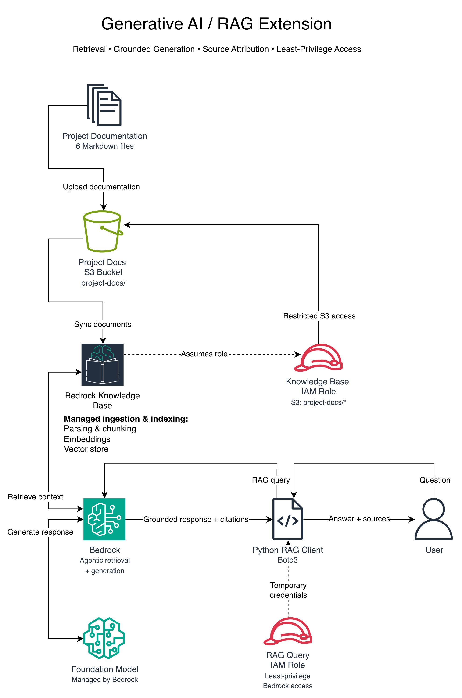

# Generative AI Extension

## Overview

This project was extended with Amazon Bedrock to build a retrieval-augmented generation (RAG) assistant for querying the project's architecture, security controls, validation evidence, and troubleshooting history.

The assistant uses the project's own documentation as its knowledge source rather than relying only on a foundation model's general knowledge.

## Architecture

The RAG workflow consists of:

1. Project documentation stored under a dedicated Amazon S3 prefix
2. An Amazon Bedrock Knowledge Base that parses and chunks the documents
3. Managed embeddings and vector storage for semantic retrieval
4. A Python/Boto3 client that submits project questions to Bedrock
5. Retrieval of relevant project documentation for each question
6. A managed foundation model that generates a response using the retrieved context
7. Source attribution showing which project documents supported the response

The initial knowledge source contains:

- `networking.md`
- `identity-and-access.md`
- `auditing.md`
- `monitoring.md`
- `threat-detection.md`
- `build-journal.md`

## Python Interface

The RAG system can be queried outside the AWS console through a Python/Boto3 command-line client in [`src/query_knowledge_base.py`](../src/query_knowledge_base.py).

A user can enter a question about the project through the client, which sends the query to Bedrock. Bedrock retrieves relevant information from the project documentation, provides that context to a foundation model, and returns a grounded response along with the project documents used as sources.

The client:

- Accepts project questions from the command line
- Uses the Bedrock Agent Runtime API
- Streams generated responses
- Extracts citation metadata from retrieved results
- Displays the project documents used as sources
- Uses environment variables for configuration rather than hardcoding the Knowledge Base ID
- Uses the AWS credential provider chain rather than storing credentials in source code

## IAM and Least-Privilege Access

The RAG extension uses separate IAM roles for the Bedrock Knowledge Base and the Python client.

The Knowledge Base role is restricted to the S3 documentation it needs to ingest. Its S3 object access was narrowed from the entire bucket to only the `project-docs/` corpus prefix.

The Python client uses a separate IAM role with only the permissions required to query the Bedrock Knowledge Base and generate a response.

The development IAM user assumes this restricted role through AWS STS. The application then runs using temporary role credentials rather than long-lived credentials stored in the project.

This separates the permissions required for knowledge ingestion, application access, and broader environment administration.

## Evaluation

The assistant was tested with questions designed to evaluate different RAG behaviors.

### Test 1: Specific Security Validation

**Question:** How did the project validate that the EC2 workload had read access to S3 but could not delete objects?

**Result:** PASS

The response correctly connected the least-privilege IAM policy, direct EC2 testing, successful object retrieval, denied object deletion, and CloudTrail/Athena audit evidence. It also correctly distinguished IAM enforcement from CloudTrail auditing.

### Test 2: Cross-Document Synthesis

**Question:** How did the project's networking, IAM, auditing, monitoring, and threat detection controls work together to create a layered security architecture?

**Result:** PASS

The response combined information across multiple project documents and described how the different security controls contributed to the overall architecture.

One generated statement described CloudTrail as recording "all API activity," which was broader than the documented validation. This demonstrates that generated responses should still be reviewed for technical precision even when retrieval is grounded in project documentation.

### Test 3: Troubleshooting Retrieval

**Question:** What networking problems occurred while building the environment, and how were they resolved?

**Result:** PASS

The response retrieved project-specific troubleshooting history, including region and CIDR issues, subnet overlap, route-table configuration, private outbound connectivity through NAT, security-group troubleshooting, and administrative access issues.

The response also preserved uncertainty around an unexplained route-table observation rather than inventing a cause.

### Test 4: Unsupported Information

**Question:** What AWS Lambda functions were deployed in this project, and what did each function do?

**Result:** PASS

The assistant correctly recognized that the project documentation did not show any AWS Lambda functions being deployed and did not make up an implementation.

Instead, it identified that the requested information was not supported by the project documentation.

## Limitations

The assistant is grounded in the documentation currently ingested into the knowledge base, so its answers are limited by the completeness and accuracy of those documents.

Retrieval grounding reduces hallucination risk but does not guarantee that every generated statement is perfectly precise. Generated responses should still be validated against the underlying project evidence, especially for security-sensitive conclusions.

The current interface is command-line based and is intended as a technical demonstration rather than a production application.
