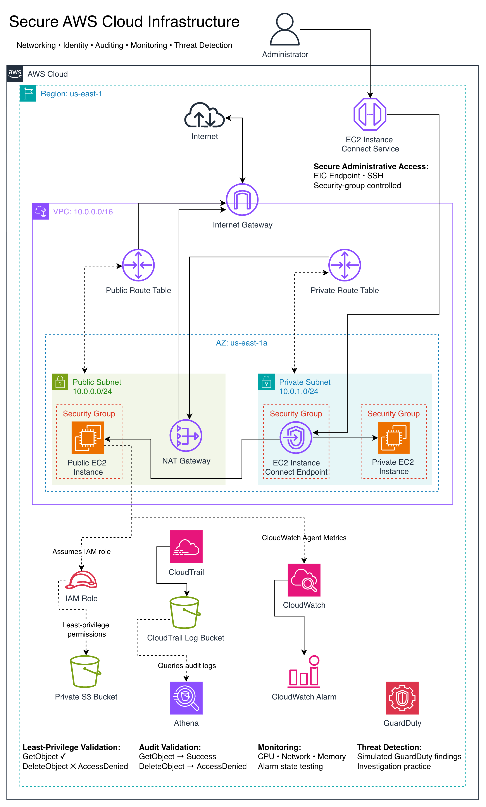

# Networking

This document explains the networking design of the original Secure AWS Cloud Infrastructure Lab environment. For the implementation process, troubleshooting, and changes that led to this architecture, see the [Build Journal](build-journal.md).

## Architecture

The environment is deployed in `us-east-1` inside a custom VPC with the CIDR block `10.0.0.0/16`.

The final network uses:

| Component | Configuration / Purpose |
|---|---|
| VPC | `10.0.0.0/16` |
| Public Subnet | `10.0.0.0/24` |
| Private Subnet | `10.0.1.0/24` |
| Internet Gateway | Internet connectivity for the VPC |
| NAT Gateway | Outbound internet access for the private subnet |
| Public EC2 | EC2 instance with public internet connectivity |
| Private EC2 | EC2 instance without a public IPv4 address |
| EIC Endpoint | Administrative access to EC2 instances |
| Security Groups | Instance and endpoint traffic control |

## Public Subnet

The public subnet contains the public EC2 instance and NAT Gateway.

Its route table sends internet-bound traffic to the Internet Gateway:

`0.0.0.0/0 → Internet Gateway`

The public EC2 instance has a public IPv4 address and can communicate with the internet through the VPC's Internet Gateway.

The NAT Gateway is also placed in the public subnet so that it can provide an internet path for resources in the private subnet.

## Private Subnet

The private subnet contains the private EC2 instance and EC2 Instance Connect Endpoint.

The private EC2 instance does not have a public IPv4 address. Instead, internet-bound traffic follows this path:

`Private EC2 → Private Route Table → NAT Gateway → Internet Gateway → Internet`

This allows the private instance to initiate outbound connections, such as downloading packages or reaching external services, without assigning a public IPv4 address directly to it.

## Routing

Separate routing behavior keeps the public and private network paths distinct.

### Public

`Public EC2 → Public Route Table → Internet Gateway → Internet`

### Private

`Private EC2 → Private Route Table → NAT Gateway → Internet Gateway → Internet`

The public subnet therefore has a direct route to the Internet Gateway, while the private subnet sends its default outbound route through the NAT Gateway.

## Administrative Access

The final design uses EC2 Instance Connect Endpoint for administrative access.

`Administrator → EC2 Instance Connect → EIC Endpoint → EC2 Instance`

Security groups control the permitted connection between the endpoint and the EC2 instances.

During development, I also tested direct SSH and using the public EC2 instance as a bastion host. These were useful for understanding different access methods, but the bastion path is not part of the final administrative-access design.

## Security Groups

Security groups provide stateful traffic filtering around the EC2 instances and EIC Endpoint.

Where appropriate, I used security-group references instead of relying on fixed IP addresses. This allows an access rule to identify an approved AWS resource by its security group rather than tying the rule to a specific client IP.

The networking design therefore combines routing and security-group controls:

- Route tables determine where traffic can be sent.
- Security groups determine which traffic is permitted to reach the associated resources.

## Design Summary

The final network separates public and private resources while providing each resource with the connectivity it needs:

- The public EC2 instance can communicate directly with the internet through the Internet Gateway.
- The private EC2 instance has no public IPv4 address.
- The NAT Gateway provides outbound internet connectivity for the private instance.
- EC2 Instance Connect Endpoint provides the final administrative-access path.
- Security groups restrict traffic between resources.
- Separate public and private routing paths maintain the intended network segmentation.

For the configuration mistakes, troubleshooting process, connectivity tests, and changes made while building this network, see the [Build Journal](build-journal.md).
